# Informe técnico — Ciclo de vida y despliegue continuo de una API

**Materia:** DevOps · Universidad de Palermo · Docente: Lucas Bonanni
**Repositorio:** https://github.com/Yago-Zaragoza-04/tp-integrador-devops
**Integrantes:** Yago Zaragoza _(completar si el trabajo se hace en pareja)_

> Las capturas se guardan en `docs/img/`. Donde dice **📸 pendiente** falta la
> imagen; el texto describe solo lo que efectivamente se observó.

---

## 0. Resumen

Una API REST de tareas en **NestJS + TypeScript** atraviesa un ciclo de vida completo y automatizado:

| Fase de la consigna | Qué se implementó |
|---|---|
| 1. Desarrollo y documentación | NestJS 11, CRUD `/api/v1/tasks`, 46 tests con Jest (unitarios + e2e, 98,3% de cobertura de líneas), **Swagger UI en `/docs`** y OpenAPI en `/openapi.json` |
| 2. Gestión de cambios | GitHub Flow, `main` protegida, PRs con evidencia, Conventional Commits validados por commitlint, **SemVer automático con semantic-release** |
| 3. Docker | Dockerfile multi-stage (`base → deps → build → test → runtime`), `node:22.23.3-alpine3.24`, usuario `node`, caché de capas, `docker compose up` levanta API + Prometheus + Grafana |
| 4. CI/CD | 8 workflows de GitHub Actions (6 reutilizables), Trivy, smoke tests, publicación en Docker Hub con tag SemVer, deploy a Render por Deploy Hook con la imagen exacta |
| 5. Observabilidad | Logs JSON (`timestamp`, `level`, `path`, `status_code`…), métricas Prometheus, dashboard "Golden Signals" hecho desde cero, alertas de 5xx y latencia |

Además: análisis OWASP Top 10 2025 aplicado a la API (unidad de Security) y blueprint de Render
como infraestructura como código del hosting (unidad de Deployment).

---

## 1. Arquitectura del pipeline

### 1.1 Diagrama de flujo: del `git push` al deploy

```mermaid
flowchart LR
    dev([Desarrollador]) -->|git push rama| pr[Pull Request a main]

    subgraph CI["ci.yml — en cada PR (checks requeridos)"]
        direction TB
        cl[commitlint<br/>commits + título]
        li[lint<br/>ESLint · hadolint · actionlint]
        te[test<br/>nest build + Jest · cobertura ≥ 80%]
        se[security<br/>npm audit · gitleaks]
        dk[docker<br/>build · Trivy · non-root · smoke]
        li --> dk
        te --> dk
        se --> dk
    end

    pr --> CI
    CI -->|todo verde| merge[Squash merge<br/>título = Conventional Commit]
    CI -.->|algo rojo| stop([🛑 PR bloqueado])

    subgraph CD["release.yml — en cada merge a main"]
        direction TB
        q[lint + test otra vez] --> sr[semantic-release<br/>tag vX.Y.Z + GitHub Release]
        sr -->|hay feat/fix/perf| pub[publish<br/>Docker Hub: X.Y.Z · X.Y · sha-xxxxxxx]
        sr -.->|solo docs/ci/build| fin([sin release])
        pub --> dep[deploy<br/>Render Deploy Hook<br/>imgURL = imagen:X.Y.Z]
        dep --> smoke[smoke post-deploy<br/>/version == X.Y.Z]
    end

    merge --> CD
    smoke --> prod[(Render<br/>API en producción)]
    prod -->|/metrics| graf[Grafana Cloud<br/>dashboard + alertas]
```



📸 pendiente: `docs/img/pipeline-run.png` — grafo de un run de `release.yml` en la pestaña Actions.

### 1.2 Componentes

| Rol | Herramienta | Dónde está |
|---|---|---|
| Control de versiones y PRs | Git + GitHub (rama `main` protegida) | Settings → Branches |
| Linters | ESLint 10, hadolint 2.14, actionlint 1.7.12, commitlint 21 | `reusable-lint.yml`, `reusable-commitlint.yml` |
| Build y tests | `nest build`, Jest 30 + supertest (unitarios y e2e), umbral 80% de líneas | `reusable-test.yml` |
| Seguridad | npm audit, gitleaks, Trivy (imagen), Dependabot | `reusable-security.yml`, `reusable-docker.yml`, `.github/dependabot.yml` |
| Runner de CI | GitHub Actions (`ubuntu-24.04`) | `.github/workflows/` |
| Versionado | semantic-release 25 + Conventional Commits | `.releaserc.json`, `release.yml` |
| Registro de imágenes | Docker Hub | `reusable-docker.yml` |
| Hosting | Render (Web Service desde imagen, plan free) | `render.yaml`, `reusable-deploy.yml` |
| Observabilidad | Prometheus + Grafana (local), Grafana Cloud (producción) | `observability/` |

### 1.3 Workflows modulares

Cada etapa vive en un workflow reutilizable (`on: workflow_call`); `ci.yml` y `release.yml` solo
los componen. Agregar una etapa nueva es un archivo `reusable-*.yml` más una línea en el caller.

| Archivo | Responsabilidad |
|---|---|
| `ci.yml` | Caller de PR: commitlint, lint, test, security → docker |
| `release.yml` | Caller de `main`: lint + test → semantic-release → publish → deploy; `rollback_version` por `workflow_dispatch` |
| `reusable-commitlint.yml` | Commits del PR **y título del PR** en Conventional Commits |
| `reusable-lint.yml` | ESLint, hadolint y actionlint |
| `reusable-test.yml` | Tests con cobertura, resumen en el job y artefacto |
| `reusable-security.yml` | `npm audit --audit-level=high` y gitleaks |
| `reusable-docker.yml` | buildx con caché GHA, Trivy, verificación non-root, smoke del contenedor, push con SBOM y provenance |
| `reusable-deploy.yml` | Deploy Hook con la imagen exacta y smoke test post-deploy |

---

## 2. Justificación técnica y decisiones de diseño

### 2.1 Optimización del contenedor

```dockerfile
ARG NODE_IMAGE=node:22.23.3-alpine3.24          # versión exacta, nunca latest
FROM ${NODE_IMAGE} AS base                       # config común
FROM base AS deps                                # solo dependencias de producción
COPY package.json package-lock.json ./           #   1) manifiestos
RUN npm ci --omit=dev --ignore-scripts           #   2) instalación (capa cacheada)
FROM base AS build                               # deps completas (CLI de Nest, TypeScript)
COPY nest-cli.json tsconfig*.json src ...        #   el código va después de las dependencias
RUN npm run build                                #   nest build → dist/
FROM build AS test                               # lint + Jest dentro de la misma base que prod
FROM base AS runtime                             # imagen final
RUN rm -rf .../npm .../corepack /opt/yarn-* ...  # sin gestores de paquetes
COPY --from=deps /app/node_modules ./node_modules
COPY --from=build /app/dist ./dist               # solo el JavaScript compilado
USER node                                        # uid 1000, no root
HEALTHCHECK ... fetch('/health') ...             # sin instalar curl
```

| Decisión | Por qué |
|---|---|
| **Alpine fijada a patch** (`22.23.3-alpine3.24`) | Imagen chica y build reproducible. `latest` cambia sin aviso (OWASP A03 — supply chain). La misma versión está en `.nvmrc`: desarrollo, CI y runtime usan el mismo Node. |
| **Multi-stage** | TypeScript, la CLI de Nest y las devDependencies se usan en `build` y no llegan a la imagen que corre: el runtime lleva solo `dist/` y dependencias de producción, con menos tamaño y menos CVEs. Es el mismo esquema base/build/prod del repo de ejemplo de la cátedra, sin `latest` y con una etapa de test. La etapa `test` permite correr la suite dentro de la misma base que producción (`docker compose --profile test run --rm test`). |
| **Orden de capas** | `package*.json` + `npm ci` antes que `src/`: cambiar código no reinstala dependencias. En CI además se usa la caché de GitHub Actions (`cache-from/to: type=gha`). |
| **Sin npm/yarn/corepack en runtime** | El proceso no los necesita; sacarlos reduce superficie de ataque y hallazgos de escáneres. |
| **Archivos de root + `USER node`** | Un proceso comprometido no puede modificar la aplicación ni escalar privilegios. CI verifica `id -u ≠ 0`. |
| **`.dockerignore` como allow-list** | Solo entra al contexto lo que alguna etapa copia: nada de `.git` ni `.env`. |
| **Compose endurecido** | `read_only: true`, `cap_drop: [ALL]`, `no-new-privileges`, `init: true` (PID 1 que reenvía señales para el graceful shutdown). |

Evidencia (`docker run --rm --entrypoint id tp-integrador-devops:local`):

```text
uid=1000(node) gid=1000(node) groups=1000(node),1000(node)
```

📸 pendiente: `docs/img/docker-compose-ps.png` — `docker compose ps` con la API `(healthy)`.

### 2.2 Estrategia de integración

**GitHub Flow** (trunk-based con ramas de vida corta): `main` siempre desplegable, una rama por
cambio (`feat/…`, `fix/…`, `ci/…`, `docs/…`), PR obligatorio y **squash merge**. Se eligió sobre
GitFlow porque el equipo es chico, el despliegue es continuo y no hay que mantener versiones en
paralelo (ver la comparación de estrategias de la unidad de Tools).

Protección de `main` (configurada por API, `enforce_admins: true`):

| Regla | Valor |
|---|---|
| PR obligatorio | sí (0 aprobaciones: el TP puede ser individual) |
| Checks requeridos | 8: commitlint, ESLint, Hadolint, actionlint, tests, npm audit, gitleaks, docker |
| Rama al día con `main` antes de mergear | sí (`strict`) |
| Historia lineal / force push / borrado | lineal · prohibido · prohibido |
| Conversaciones resueltas | obligatorio |
| Método de merge | solo squash; el commit toma el **título del PR** |

El squash hace que cada PR deje exactamente un commit en `main`, cuyo mensaje es el título del PR.
Por eso commitlint valida también el título: es lo que semantic-release lee para decidir la versión.

Un push directo a `main` es rechazado:

```text
$ git push origin main
remote: - Changes must be made through a pull request.
remote: - 8 of 8 required status checks are expected.
 ! [remote rejected] main -> main (protected branch hook declined)
```

📸 pendiente: `docs/img/branch-protection.png` — Settings → Branches → regla de `main`.

### 2.3 Versionado: SemVer con semantic-release

| Commit (título del PR) | Efecto |
|---|---|
| `feat(...)` | MINOR (`1.0.0 → 1.1.0`) |
| `fix(...)`, `perf(...)`, `revert` | PATCH (`1.1.0 → 1.1.1`) |
| `feat(...)!` o footer `BREAKING CHANGE:` | MAJOR (`1.1.1 → 2.0.0`) |
| `docs`, `ci`, `build`, `test`, `refactor`, `chore` | sin release |

semantic-release crea el tag `vX.Y.Z` y el GitHub Release con las notas agrupadas en español; **no
commitea en `main`** (no hace falta saltear la protección). La imagen se publica como `X.Y.Z`,
`X.Y` y `sha-<commit>`; Render recibe la referencia `X.Y.Z` exacta. Se descartaron los otros dos
esquemas de la consigna como principal porque SemVer comunica compatibilidad, pero el tag
`sha-<commit>` se publica igual para trazabilidad inmutable imagen ↔ commit.

La historia de `main` muestra el efecto de la convención: el PR #1 (`feat(api): …`) trae la API, el
PR #2 (`build(docker): …`) y el PR #3 (`ci: …`) no generan versión por sí mismos, y al mergear el PR #3
—cuando el workflow de release ya existe— semantic-release analiza los commits desde el inicio y
calcula **v1.0.0** a partir del `feat`. Los PR de documentación (`docs: …`) no cambian la versión.

### 2.4 Estructura del proyecto (alineada con el ejemplo de la cátedra)

La organización sigue la del repositorio de ejemplo
[lucasbonanni/node-service-devops](https://github.com/lucasbonanni/node-service-devops) (NestJS):

```
src/
  main.ts                         bootstrap: config validada, logger JSON, graceful shutdown
  app.module.ts                   módulo raíz (controllers, providers, throttler, terminus)
  app.setup.ts                    helmet, límite de body, ValidationPipe, filtro global y Swagger
  tasks.controller.ts             CRUD /api/v1/tasks
  tasks.service.ts                repositorio en memoria
  task.dto.ts                     DTOs validados con class-validator y documentados con @nestjs/swagger
  health.controller.ts            /health (terminus), /ready, /version
  metrics.controller.ts           /metrics + guard Bearer
  metrics.service.ts              registro de prom-client
  chaos.controller.ts             fallas controladas
  exception.filter.ts             errores genéricos con error_id
  request-logging.middleware.ts   log JSON + métricas por request
  *.spec.ts                       tests unitarios (Jest)
test/
  *.e2e-spec.ts, jest-e2e.json    tests e2e con supertest sobre la app completa
Dockerfile · docker-compose.yml · makefile · nest-cli.json · tsconfig*.json · .prettierrc
.github/workflows/ · observability/ · scripts/ · render.yaml · docs/
```

Diferencias deliberadas con el ejemplo: npm en lugar de yarn (`package-lock.json` + `npm ci`), imagen
base fijada en lugar de `node:24-alpine`, workflows modulares en lugar de uno solo, y las credenciales
siempre como secretos (nunca en `docker-compose.yml` ni como build args de la imagen).

### 2.5 Diseño de la API

| Endpoint | Uso |
|---|---|
| `GET/POST /api/v1/tasks`, `GET/PUT/DELETE /api/v1/tasks/{id}` | CRUD de tareas (repositorio en memoria, ids UUID) |
| `GET /docs`, `GET /openapi.json` | Documentación interactiva (requisito excluyente) |
| `GET /health`, `GET /ready` | Liveness y readiness (`/ready` da 503 durante el apagado) |
| `GET /version` | Versión y commit desplegados (los valida el smoke test post-deploy) |
| `GET /metrics` | Métricas Prometheus (Bearer opcional con `METRICS_TOKEN`) |
| `GET /api/v1/chaos/error`, `/latency` | Fallas controladas, **solo** con `CHAOS_ENABLED=true` |

La documentación se genera desde el código con `@nestjs/swagger` (decoradores en controllers y DTOs),
así que la spec no puede quedar desactualizada respecto de la API. Un test e2e verifica que todas las
rutas estén documentadas y que `info.version` sea la versión desplegada.

Configuración por variables de entorno validadas al arrancar (`src/config.ts`): `PORT`, `HOST`,
`LOG_LEVEL`, `APP_VERSION`, `GIT_SHA`, `CHAOS_ENABLED`, `METRICS_TOKEN`, `RATE_LIMIT_MAX`,
`RATE_LIMIT_WINDOW_MS`, `TRUST_PROXY`. Un valor inválido corta el arranque con un log `fatal`.

### 2.6 Seguridad (OWASP Top 10 2025)

| Riesgo | Control en este repo |
|---|---|
| A01 Broken Access Control | ids UUID no enumerables (`ParseUUIDPipe`), rate limit por IP (`@nestjs/throttler`), 404 por defecto |
| A02 Security Misconfiguration | helmet (CSP, HSTS, nosniff), sin `x-powered-by`, chaos apagado por defecto, config validada |
| A03 Supply Chain | `package-lock` + `npm ci`, base fijada, npm audit, Trivy, Dependabot, SBOM y provenance |
| A04 Cryptographic Failures | sin secretos en el código; HTTPS de Render; secretos solo en GitHub/Render |
| A05 Injection | `ValidationPipe` global con DTOs de class-validator, `whitelist` + `forbidNonWhitelisted` (allow-list estricta) y longitudes acotadas |
| A06 Insecure Design | rate limit, payload ≤ 10 kb, latencia de chaos acotada a 5 s |
| A07 Authentication Failures | el token de `/metrics` se compara en tiempo constante |
| A08 Integrity Failures | solo JSON (sin deserialización nativa), imagen inmutable por versión + sha |
| A09 Logging & Alerting | logs JSON con `request_id`, header `authorization` redactado, alertas |
| A10 Exceptional Conditions | `AllExceptionsFilter`: 500 genérico con `error_id`, stack solo en logs; fail-fast; graceful shutdown |

Cada fila tiene su test en `test/security.e2e-spec.ts`, `src/config.spec.ts` o `test/tasks.e2e-spec.ts`.

---

## 3. Aplicación de la filosofía DevOps

### 3.1 Primera Forma — flujo y consistencia

**Tareas manuales que quedaron 100% automatizadas:**

| Antes (manual) | Ahora |
|---|---|
| Correr lint y tests "si me acuerdo" | Checks requeridos en cada PR |
| Revisar que los commits sigan la convención | commitlint sobre commits y título |
| Decidir el número de versión y escribir el changelog | semantic-release |
| `docker build`, `docker tag`, `docker push` | `reusable-docker.yml` con tags derivados de la versión |
| Escanear la imagen y las dependencias | Trivy, npm audit, gitleaks, Dependabot |
| Entrar a Render y redeployar | Deploy Hook con `imgURL` exacta |
| Probar a mano que el deploy quedó bien | smoke test que exige `/version == X.Y.Z` |
| Levantar el entorno local | `docker compose up --build -d` |

**Mismo entorno en desarrollo y en CI/CD:**
- Node se fija en un solo lugar por ambiente y con el mismo valor: `.nvmrc` (CI usa
  `setup-node` con `node-version-file`) y `ARG NODE_IMAGE` del Dockerfile (runtime y etapa `test`).
- Dependencias con `npm ci` sobre `package-lock.json` en todos lados.
- CI construye la **misma** etapa `runtime` que se publica, la corre con `--read-only --cap-drop ALL`
  y le aplica el mismo smoke test que se usa después contra Render.
- La imagen que se prueba es la que se despliega: Render recibe el tag exacto, no reconstruye.

### 3.2 Segunda Forma — feedback rápido y Andon Cord

**Dónde se corta el cable:**

| Punto | Condición de corte | Consecuencia |
|---|---|---|
| commitlint | commit o título fuera de Conventional Commits | el PR no se puede mergear |
| lint | error de ESLint, regla de hadolint o actionlint | ídem |
| test | un test falla o la cobertura baja de 80% | ídem; la imagen ni se construye (`needs`) |
| security | vulnerabilidad alta/crítica en dependencias de producción o secreto filtrado | ídem |
| docker | falla el build, CVE CRITICAL con parche (Trivy), corre como root o falla el smoke | ídem |
| release | `main` en rojo | no hay tag, ni imagen, ni deploy |
| deploy | `/version` no responde la versión liberada en 15 minutos | job rojo, el equipo ve la falla |

**Caso real (experimento controlado, [PR #9](https://github.com/Yago-Zaragoza-04/tp-integrador-devops/pull/9)):** se volvió a fijar la imagen base en
`node:22.20.0-alpine3.22`, una versión anterior. El [run 37074394121](https://github.com/Yago-Zaragoza-04/tp-integrador-devops/actions/runs/37074394121)
pasó commitlint, lint, test y security, pero falló en `docker / Build, scan y smoke test`: Trivy
encontró **CVE-2026-31789 (CRITICAL)** en `libcrypto3 3.5.4-r0`, con parche en `3.5.6-r0`:

```text
Total: 2 (CRITICAL: 2)
│ libcrypto3 │ CVE-2026-31789 │ CRITICAL │ fixed │ 3.5.4-r0 │ 3.5.6-r0 │ openssl: Heap buffer overflow on 32-bit systems │
##[error]Process completed with exit code 1.
```

El check requerido quedó en rojo y la protección de `main` impidió el merge; la imagen no se
publicó. La base vigente, `node:22.23.3-alpine3.24` (la misma versión que `.nvmrc`), da 0 hallazgos
CRITICAL/HIGH. El PR se cerró sin mergear: un artefacto vulnerable nunca llegó a `main`.

📸 pendiente: `docs/img/andon-trivy.png` — checks del PR #9 con `docker` en rojo.

**Visibilidad de fallos en producción:**

| Síntoma | Señal | Herramienta |
|---|---|---|
| Respuestas 5xx | métrica `http_requests_total{status_code=~"5.."}`; log `level:"error"` con `error_id` | Panel "Errores por segundo", alerta `HighErrorRate` (> 5% durante 2 min) |
| Latencia alta | histograma `http_request_duration_seconds` → p95 | Panel "Latencia p50/p95/p99", alerta `HighLatencyP95` (> 1 s durante 5 min) |
| API caída | `up{job="tp-api"} == 0` / health check de Render | alerta `ApiDown`, eventos de Render |

### 3.3 Tercera Forma — experimentación y fallas controladas

#### Experimento 1 — inyección de errores 5xx y latencia (monitoreo)
- **Hipótesis:** si el 15% del tráfico va a los endpoints de chaos, el dashboard muestra 5xx y suba
  de p95, y la alerta `HighErrorRate` pasa a *pending* en menos de 2 minutos.
- **Acción:** `DURATION_S=150 RPS=15 CHAOS_RATIO=0.15 docker compose --profile load run --rm loadgen`
- **Resultado observado:**
  ```text
  [final] requests=2266 200:1254 201:405 204:97 400:150 404:181 500:179 net_errors=0 p50=1.6ms p95=940.9ms
  Prometheus: tráfico 15.1 req/s · p95 0.735 s · tasa de 5xx 8.3% · ≈185 respuestas 5xx en 5 min
  Alertas: HighErrorRate pending (desde 22:52:25 UTC) · HighLatencyP95 inactive · ApiDown inactive
  ```
- **Recuperación:** se corta el generador; la tasa de 5xx vuelve a 0 y la alerta se resuelve.
- **Aprendizaje:** el umbral de 5% detecta el problema sin falsos positivos con tráfico normal
  (los 4xx son errores del cliente y no disparan la alerta).

📸 pendiente: `docs/img/dashboard-chaos.png` — dashboard durante el experimento.

#### Experimento 2 — configuración inválida (fail fast)
- **Acción:** `PORT=abc node dist/main.js`
- **Resultado:** un único log `fatal` y salida con código 1, sin servir tráfico a medias:
  ```text
  {"level":"fatal",...,"reason":"Configuración inválida: PORT debe ser un entero entre 1 y 65535 (recibido \"abc\")","msg":"invalid configuration"}
  exit=1
  ```
- **Aprendizaje:** en Render, una instancia mal configurada no pasa el health check y el servicio
  sigue en la versión anterior.

#### Experimento 3 — imagen base vulnerable (supply chain)
Descripto en §3.2: Trivy bloqueó el PR por un CVE crítico en OpenSSL. **Aprendizaje:** fijar la
versión da reproducibilidad pero no seguridad por sí sola; hace falta el escaneo en el pipeline y
Dependabot para actualizar la base.

#### Experimento 4 — regresión de contrato y commit fuera de convención
- **Hipótesis:** si un cambio rompe el contrato de la API y además no respeta Conventional Commits,
  el PR queda bloqueado y no se construye ninguna imagen.
- **Acción ([PR #10](https://github.com/Yago-Zaragoza-04/tp-integrador-devops/pull/10)):** el test e2e del alta espera `200` en lugar de `201`; el commit y
  el título del PR son `update tests`.
- **Resultado ([run 37074418679](https://github.com/Yago-Zaragoza-04/tp-integrador-devops/actions/runs/37074418679)):**
  ```text
  commitlint / Conventional Commits
  ✖   subject may not be empty [subject-empty]
  ✖   type may not be empty [type-empty]
  test / Unit tests + cobertura
      expected 200 "OK", got 201 "Created"
  Tests:       1 failed, 45 passed, 46 total
  docker → skipped (needs: [lint, test, security])
  ```
- **Aprendizaje:** los dos cortes son independientes (commitlint corre en paralelo) y `needs` evita
  gastar minutos de build en un cambio que ya está rojo. El PR se cerró sin mergear.

📸 pendiente: `docs/img/andon-test-commitlint.png` — checks del PR #10.

#### Pendiente de documentar con capturas
Rollback con `gh workflow run release.yml -f rollback_version=<anterior>` (requiere al menos dos
versiones publicadas en Docker Hub).

---

## 4. Principios Lean — reducción de desperdicio

| Desperdicio (Poppendieck) | Cómo aparecía | Cómo lo evita esta solución |
|---|---|---|
| **Esperas y builds manuales** (*Delays*) | Compilar, taggear y subir la imagen a mano; esperar a que alguien despliegue | El merge dispara versión, imagen y deploy sin intervención; feedback de CI en ~1 minuto por PR |
| **Defectos detectados tarde** (*Defects*) | Un bug o un CVE se descubre en producción | Tests, cobertura, Trivy, audit y smoke en el PR: el defecto se corrige donde se produce (caso real del CVE de OpenSSL) |
| **Configuración manual de servidores** (*Handoffs / Re-learning*) | Pasos de instalación en la cabeza de una persona | Dockerfile, compose, workflows y `render.yaml` versionados: el entorno se recrea con un comando |
| **Trabajo a medio hacer** (*Partially done work*) | Ramas largas sin integrar | Ramas cortas, PRs chicos (un tema por PR) e integración diaria a `main` |

Además, el tamaño de lote chico se ve en la historia: cada PR dejó un único commit en `main` con
un tipo claro (`chore`, `feat`, `build`, `ci`, `docs`).

---

## 5. Observabilidad en detalle

### 5.1 Logs estructurados

Un objeto JSON por línea en stdout (pino). Cada request emite un evento `request completed`:

```json
{"level":"info","timestamp":"2026-10-02T22:54:28.371Z","service":"tp-integrador-devops","version":"0.0.0-local","request_id":"7b3de4b9-6ab0-4d7e-b665-334e776e66f0","method":"POST","path":"/api/v1/tasks","route":"/api/v1/tasks","status_code":201,"duration_ms":0.65,"msg":"request completed"}
```

Nivel según el resultado (2xx/3xx `info`, 4xx `warn`, 5xx `error`; `/health`, `/ready` y
`/metrics` en `debug`). Los logs internos de Nest también salen en JSON (`PinoLoggerService`). El
contrato lo verifican los tests de `test/observability.e2e-spec.ts`.

### 5.2 Métricas y dashboard

- `http_requests_total{method,route,status_code}` y `http_request_duration_seconds` (histograma
  de 5 ms a 5 s). `route` es el patrón de ruta que registra Nest (`/api/v1/tasks/:id`), nunca la URL cruda, para
  acotar la cardinalidad.
- Dashboard **"TP DevOps — Golden Signals"** (`observability/grafana/dashboards/golden-signals.json`),
  escrito desde cero —sin plantillas de la comunidad—, 20 paneles en 5 filas: Resumen, Tráfico
  (req/s, RPM, por código y por ruta), Latencia (p50/p95/p99, p95 por ruta), Errores (4xx vs 5xx,
  tasa, tabla por ruta) y Runtime de Node. Usa una variable `datasource`, así el mismo JSON se
  importa en Grafana local y en Grafana Cloud.

Consultas de las golden signals:

```promql
sum(rate(http_requests_total{route!="/metrics"}[$__rate_interval]))                    # tráfico
histogram_quantile(0.95, sum by (le) (rate(http_request_duration_seconds_bucket[$__rate_interval])))  # p95
sum(rate(http_requests_total{status_code=~"5.."}[$__rate_interval]))                   # 5xx
```

📸 pendiente: `docs/img/dashboard-golden-signals.png` — dashboard con tráfico del generador.

### 5.3 Producción: Render + Grafana Cloud

Render (plan free) no permite correr un colector de métricas (p. ej. Grafana Alloy) al lado de la app, así que Grafana Cloud
**scrapea** la API: *Connections → Metrics Endpoint* → URL `https://<servicio>.onrender.com/metrics`,
autenticación Bearer con el mismo valor de `METRICS_TOKEN` cargado en Render, intervalo 60 s.
Después se importa el JSON del dashboard eligiendo el datasource `grafanacloud-*-prom` y se
recrean las alertas `HighErrorRate` y `HighLatencyP95` como alert rules. Los logs JSON se ven en
la pestaña Logs de Render.

📸 pendiente: configuración del scrape job y dashboard en Grafana Cloud.

---

## 6. Cómo reproducirlo

```bash
# Local
npm ci && npm run lint && npm run test:cov
docker compose up --build -d                     # http://localhost:3000/docs · :9090 · :3001
docker compose --profile load up loadgen         # tráfico para el dashboard

# Configuración del pipeline (una sola vez)
gh variable set DOCKERHUB_USERNAME               # usuario de Docker Hub
gh secret set DOCKERHUB_TOKEN                    # Access Token (Read & Write), no la contraseña
gh secret set RENDER_DEPLOY_HOOK_URL             # Render → Settings → Deploy Hook
gh variable set RENDER_SERVICE_URL               # https://<servicio>.onrender.com
```

---

## 7. Limitaciones y próximos pasos

- El repositorio de tareas es en memoria: un reinicio borra los datos (la lógica de negocio no es
  foco de la consigna). `TasksService` aísla el almacenamiento: cambiarlo por una base no toca los controladores.
- Render free duerme el servicio sin tráfico: el primer request tarda; el smoke post-deploy espera
  hasta 15 minutos.
- Pendiente: deploy en Kubernetes (objetivo opcional de la materia), aprobación manual con
  *environment reviewers* si se pasa de Continuous Deployment a Continuous Delivery, y firma de
  imágenes (cosign).
